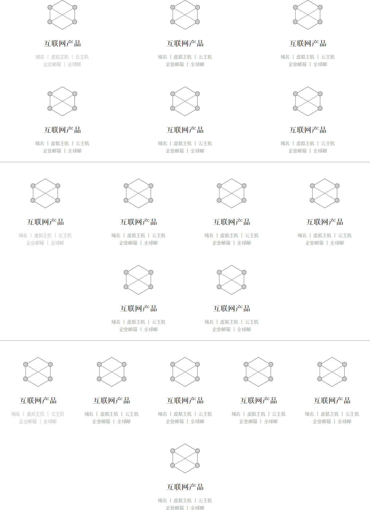
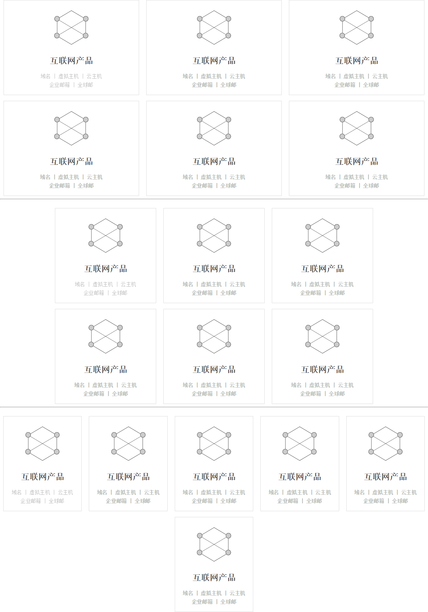

# dxys

一个列表组样式

## CSS Class

* .dxys  组件容器。一般用ul元素。
* .dxys.cols-3  每行3个子项
* .dxys.cols-4  每行4个子项
* .dxys.cols-5  每行5个子项
* .dxys.border  子项有边框
* .dxys-h1  子项的标题
* .dxys-h2  子项的副标题
* .dxys-text 子项的普通文字
* .dxys-icon  子项的icon
* .dxys-btn  按钮

## 层次关系：

```
.dxys
    .dxys-item
        .dxys-icon
        .dxys-h1
        .dxys-h2
        .dxys-text
    .dxys-item
    .dxys-item
    .dxys-item

工具类
.dxys-btn
```

## 示例

> 示例中间的横线是100%宽度参考线

示例一：子项无边框



示例二：子项有边框


